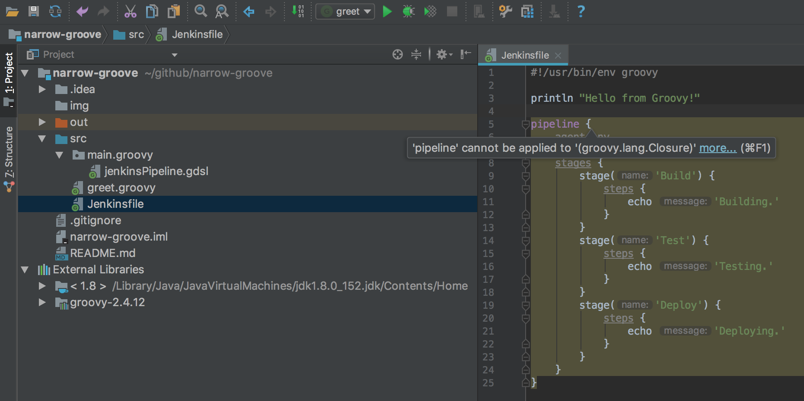

# narrow-groove

Jenkins Pipeline GDSL Autocompletion in IntelliJ IDEA.

## Problem

### `'pipeline' cannot be applied to '(groovy.lang.Closure)'`



## Environment

### IntelliJ IDEA 2017.2.5

Build #IC-172.4343.14, built on September 26, 2017
JRE: 1.8.0_152-release-915-b12 x86_64
JVM: OpenJDK 64-Bit Server VM by JetBrains s.r.o
Mac OS X 10.13

### IntelliJ IDEA GDSL

[IntelliJ IDEA GDSL](src/main/groovy/jenkinsPipeline.gdsl) file extracted from Jenkins 2.73.2 on Wednesday, October 18, 2017.

Using below Groovy script inside Jenkins's Script Console.

```
plugins = [:]
jenkins.model.Jenkins.instance.getPluginManager().getPlugins().each {plugins << ["${it.getShortName()}":"${it.getVersion()}"]}
plugins.sort().each() { println "${it.key}:${it.value}"}
```

Output:

```
ace-editor:1.1
ant:1.7
antisamy-markup-formatter:1.5
authentication-tokens:1.3
bouncycastle-api:2.16.2
branch-api:2.0.14
build-timeout:1.19
cloudbees-folder:6.2.1
credentials:2.1.16
credentials-binding:1.13
display-url-api:2.1.0
docker-commons:1.9
docker-workflow:1.13
durable-task:1.15
email-ext:2.60
git:3.6.0
git-client:2.5.0
git-server:1.7
github:1.28.0
github-api:1.89
github-branch-source:2.2.3
gradle:1.28
handlebars:1.1.1
jackson2-api:2.8.7.0
jquery-detached:1.2.1
junit:1.21
ldap:1.17
mailer:1.20
mapdb-api:1.0.9.0
matrix-auth:2.1
matrix-project:1.12
momentjs:1.1.1
pam-auth:1.3
pipeline-build-step:2.5.1
pipeline-github-lib:1.0
pipeline-graph-analysis:1.5
pipeline-input-step:2.8
pipeline-milestone-step:1.3.1
pipeline-model-api:1.2.2
pipeline-model-declarative-agent:1.1.1
pipeline-model-definition:1.2.2
pipeline-model-extensions:1.2.2
pipeline-rest-api:2.9
pipeline-stage-step:2.2
pipeline-stage-tags-metadata:1.2.2
pipeline-stage-view:2.9
plain-credentials:1.4
resource-disposer:0.8
scm-api:2.2.3
script-security:1.34
ssh-credentials:1.13
ssh-slaves:1.22
structs:1.10
subversion:2.9
timestamper:1.8.8
token-macro:2.3
workflow-aggregator:2.5
workflow-api:2.22
workflow-basic-steps:2.6
workflow-cps:2.41
workflow-cps-global-lib:2.9
workflow-durable-task-step:2.17
workflow-job:2.15
workflow-multibranch:2.16
workflow-scm-step:2.6
workflow-step-api:2.13
workflow-support:2.16
ws-cleanup:0.34
```